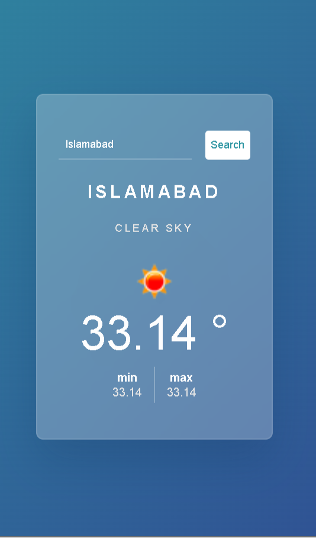

# WHEATHER_APP
 
## Table of contents

- [Overview](#overview)
  - [Screenshot](#screenshot)
  - [Links](#links)
- [My process](#my-process)
  - [Built with](#built-with)
  - [What I learned](#what-i-learned)
  - [Continued development](#continued-development)
- [Author](#author)
- [Acknowledgments](#acknowledgments)


## Overview

This is a simple weather application that allows users to search for the current weather of any city. It uses the [OpenWeatherMap API](https://openweathermap.org/api) to fetch the weather details and displays information such as temperature, weather description, and min/max temperatures.


### Screenshot

WHEATHER_APP




### Links

- Solution: [https://github.com/HooriaSaeeda/WeatherApp.git](https://github.com/HooriaSaeeda/WeatherApp.git)
- Live Site URL: [https://hooriasaeeda.github.io/WeatherApp/](https://hooriasaeeda.github.io/WeatherApp/)

## My process

### Built with

- Semantic HTML5 markup
- CSS custom properties (Variables)
- Vanilla JavaScript (ES6+)
- Fetch API
- OpenWeatherMap API

### What I learned

This project helped me understand how to fetch real-time data from a third-party API and dynamically update the UI with JavaScript. Below is an important snippet showing how I handled the API call and processed the weather data:

```javascript
let getWeather = () => {
  let cityValue = cityRef.value;
  if (cityValue.length == 0) {
    result.innerHTML = `<h3 class="msg">Please enter a city name</h3>`;
  } else {
    let url = `https://api.openweathermap.org/data/2.5/weather?q=${cityValue}&appid=${key}&units=metric`;
    fetch(url)
      .then((Resp) => Resp.json())
      .then((data) => {
        result.innerHTML = `
          <h2>${data.name}</h2>
          <h4 class="weather">${data.weather[0].description}</h4>
          
          <h1>${data.main.temp} &#176</h1>
          <div class="temp-container">
            <div>
              <h4 class="title">min</h4>
              <h4 class="temp">${data.main.temp_min}</h4>
            </div>
            <div>
              <h4 class="title">max</h4>
              <h4 class="temp">${data.main.temp_max}</h4>
            </div>
          </div>
        `;
      })
      .catch(() => {
        result.innerHTML = `<h3 class="msg">City not found</h3>`;
      });
  }
};

```
### Continued development

I plan to improve this app by:

- Adding more weather details (e.g., humidity, wind speed)
- Implementing a more sophisticated UI/UX design
- Optimizing the app for better performance on slower networks

## Author

- Github - [HooriaSaeeda](https://github.com/HooriaSaeeda)
- Frontend Mentor - [HooriaSaeeda](https://www.frontendmentor.io/profile/HooriaSaeeda)
- Linkedin - [Hoor Seyda](linkedin.com/in/hoor-seyda-901176222)

## Acknowledgments

A big thanks to Frontend Mentor for the design inspiration and challenges. Also, a special mention to the OpenWeatherMap team for providing a free weather API.
